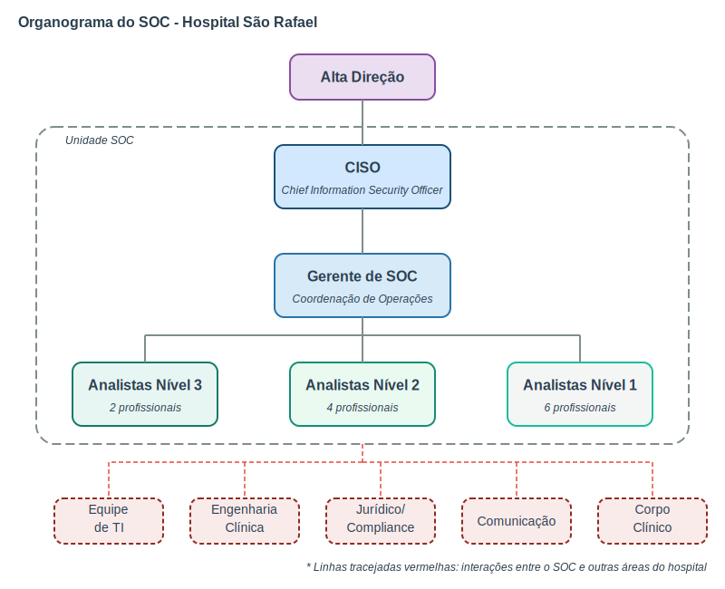
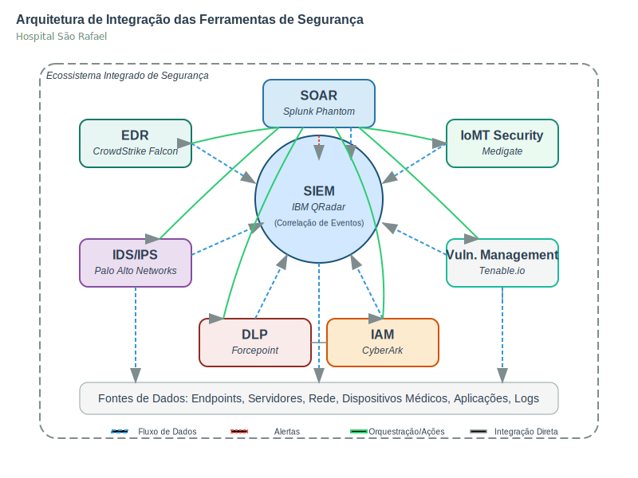

# Projeto Executivo: SOC para Hospital São Rafael

### Estruturação Estratégica de um Security Operations Center (SOC) em Ambiente Hospitalar

**Equipe**

- Amarildo Lucena - [ajfl@cesar.school](mailto:ajfl@cesar.school)
- Julio Vilar - [jvmm@cesar.school](mailto:jvmm@cesar.school)
- Rafael Winter - [rwt@cesar.school](mailto:rwt@cesar.school)

**Instituição:**  

CESAR School

  

**Data:**  
Abril de 2025

## Sumário

1. [Introdução](#introdução)
   - [Custos e dados financeiros](#custos-e-dados-financeiros)
   - [Consequencias de ataques e cases](#consequencias-de-ataques-e-cases)
   - [Influência da pandemia, evolução tecnológica e cenário regulatório](#influência-da-pandemia-evolução-tecnológica-e-cenário-regulatório)
   - [Riscos Cibernéticos na Saúde: Como se Diferenciam do OWASP Top 10](#riscos-cibernéticos-na-saúde-como-se-diferenciam-do-owasp-top-10)

2. [Perfil do Hospital](#perfil-do-hospital)
   - [Apresentação](#apresentação)
   - [Gestão de Prontuários e Informações Sensíveis](#gestão-de-prontuários-e-informações-sensíveis)
   - [Recursos Humanos e Organização Administrativa](#recursos-humanos-e-organização-administrativa)
   - [Infraestrutura Tecnológica](#infraestrutura-tecnológica)
   - [Dispositivos IoMT e Integração Clínica](#dispositivos-iomt-e-integração-clínica)

3. [Estrutura Organizacional do SOC](#estrutura-organizacional-do-soc)
   - [Objetivos do Projeto](#objetivos-do-projeto)
   - [Visão Geral da Estrutura](#visão-geral-da-estrutura)
   - [Papéis e Responsabilidades](#papéis-e-responsabilidades)
   - [Modelo Operacional e Turnos](#modelo-operacional-e-turnos)
   - [Integração com Outras Áreas do Hospital](#integração-com-outras-áreas-do-hospital)
   - [Desenvolvimento e Capacitação Contínua](#desenvolvimento-e-capacitação-contínua)

4. [Ferramentas de Segurança do SOC](#ferramentas-de-segurança-do-soc)
   - [Plataforma Central: SIEM](#plataforma-central-siem-security-information-and-event-management)
   - [EDR (Endpoint Detection and Response)](#edr-endpoint-detection-and-response)
   - [Proteção de Rede: IDS/IPS](#proteção-de-rede-idsips-intrusion-detectionprevention-system)
   - [SOAR (Security Orchestration, Automation and Response)](#soar-security-orchestration-automation-and-response)
   - [Proteção Específica para Dispositivos Médicos (IoMT)](#proteção-específica-para-dispositivos-médicos-iomt)
   - [Gestão de Vulnerabilidades](#gestão-de-vulnerabilidades)
   - [DLP (Data Loss Prevention)](#dlp-data-loss-prevention)
   - [Monitoramento de Identidade e Acesso (IAM)](#monitoramento-de-identidade-e-acesso-iam)
   - [Integração e Orquestração de Ferramentas](#integração-e-orquestração-de-ferramentas)
   - [Resumo de Investimentos e Implantação](#resumo-de-investimentos-e-implantação)

5. [Compartilhamento de informações e análise de tendências](#compartilhamento-de-informações-e-análise-de-tendências)
   - [Análise Comparativa de ISAC's com foco na área de saúde](#análise-comparativa-de-isacs-com-foco-na-área-de-saúde)
   - [Sugestão de ISAC: Proposta de Melhoria após Análise Comparativa](#sugestão-de-isac-proposta-de-melhoria-após-análise-comparativa)

6. [Requisitos de Conformidade Regulatória](#requisitos-de-conformidade-regulatória)
   - [Conformidade com a LGPD](#conformidade-com-a-lgpd)
   - [Conformidade com a ISO 27001](#conformidade-com-a-iso-27001)
   - [Outros Requisitos Regulatórios Setoriais](#outros-requisitos-regulatórios-setoriais)
   - [Estrutura de Governança para Conformidade](#estrutura-de-governança-para-conformidade)
   - [Revisão e Aprimoramento Contínuo](#revisão-e-aprimoramento-contínuo)

7. [Plano de Resposta a Incidentes Cibernéticos Hospitalares](#plano-de-resposta-a-incidentes-cibernéticos-hospitalares)
   - [Definição de criticidade](#definição-de-criticidade)
   - [Fluxo de Resposta a Incidentes](#fluxo-de-resposta-a-incidentes)
   - [Processo de Comunicação e Escalonamento](#processo-de-comunicação-e-escalonamento)
   - [Documentação de Incidentes](#documentação-de-incidentes)
   - [Simulações e Melhoria Contínua](#simulações-e-melhoria-contínua)

8. [Conclusão](#conclusão)

9. [Referências](#referências)
   - [Relatórios Técnicos e Pesquisas](#relatórios-técnicos-e-pesquisas)
   - [Artigos e Notícias sobre Incidentes](#artigos-e-notícias-sobre-incidentes)
   - [Informações sobre Ferramentas e Vulnerabilidades](#informações-sobre-ferramentas-e-vulnerabilidades)
   - [Normas e Legislações](#normas-e-legislações)

## Introdução

O setor de saúde tem se tornado um alvo cada vez mais atrativo para ataques cibernéticos devido ao alto valor dos dados de pacientes, à crescente digitalização dos serviços médicos e à dependência crítica de sistemas tecnológicos para procedimentos e atendimentos. Hospitais são particularmente vulneráveis devido à combinação de dados sensíveis, sistemas legados, dispositivos médicos conectados (IoMT) e o impacto potencialmente fatal de interrupções operacionais.

### Custos e dados financeiros

O setor de saúde continua sendo o mais afetado por violação de dados, com um custo médio de US$ 9,77 milhões por incidente, o maior entre as indústrias, segundo o relatório da IBM "Cost of a Data Breach 2024". Embora tenha havido uma redução de 10,6% em relação a 2023, o valor ainda é mais que o dobro da média global de US$ 4,88 milhões.

O uso de IA e automação reduziu os custos das violações em até US$ 2,22 milhões e acelerou a detecção e contenção dos incidentes. A OMS reportou um aumento de 500% nos incidentes de segurança cibernética em instalações de saúde durante a pandemia de COVID-19, período em que a digitalização acelerada dos serviços criou novas vulnerabilidades.

### Consequencias de ataques e cases

Ataques cibernéticos ao setor de saúde têm se tornado uma das principais ameaças à segurança das informações e à continuidade dos serviços médicos. Com o aumento do uso de tecnologia e sistemas digitais nos hospitais e clínicas, os cibercriminosos têm explorado vulnerabilidades, visando dados sensíveis dos pacientes, como históricos médicos, diagnósticos e informações pessoais. Os ransomware, phishing e ataques DDoS são as formas mais comuns desses ataques. As consequências podem ser devastadoras: desde a perda de dados médicos essenciais até a interrupção de serviços de saúde críticos, afetando diretamente a vida dos pacientes. Em alguns casos, como já documentado, ataques cibernéticos resultaram em mortes e danos irreparáveis à integridade física de pessoas. Além disso, as instituições de saúde enfrentam prejuízos financeiros significativos, tanto pelos custos associados ao resgate (no caso de ransomware), quanto pela paralisação de sistemas e a reconstrução de infraestruturas comprometidas.

No cenário global, os números de ataques cibernéticos no setor de saúde são alarmantes. Em 2024, 43% das empresas de saúde ao redor do mundo foram vítimas de ciberataques, com destaque para os ataques de ransomware, que continuam a ser uma das maiores ameaças à segurança cibernética no setor (Kaspersky, 2024). No Brasil, o cenário é igualmente preocupante: 47% das instituições de saúde registraram ataques cibernéticos em 2024, evidenciando a crescente vulnerabilidade desse setor no país (Kaspersky, 2024). Em 2023, o aumento dos ataques foi significativo, com um crescimento de 20% em relação ao ano anterior, destacando o risco crescente de ciberameaças à medida que a digitalização do setor de saúde avança (Check Point Research, 2023). Esses dados ressaltam a urgência da implementação de medidas de segurança cibernética no setor, a fim de proteger tanto as informações dos pacientes quanto a continuidade dos serviços médicos.

Em termos de casos emblemáticos, o ataque ao Hospital Universitário de Düsseldorf na Alemanha, em 2020, se destaca como um dos mais graves e significativos no setor de saúde. O ataque de ransomware resultou na morte de uma paciente, que não conseguiu receber o tratamento adequado devido à interrupção dos sistemas hospitalares (BBC News, 2020). Esse incidente trouxe à tona as consequências fatais que um ataque cibernético pode causar quando sistemas críticos de saúde são comprometidos. Outro caso de grande repercussão foi o ataque ao National Health Service (NHS) no Reino Unido em 2017, que afetou mais de 200.000 pessoas, causando o cancelamento de cirurgias e consultas e expondo a vulnerabilidade dos sistemas de saúde pública à ação de cibercriminosos (Reuters, 2017).

No Brasil, a Rede D'Or São Luiz, uma das maiores redes hospitalares privadas do país, foi alvo de um ataque cibernético em 2021. O incidente resultou na perda de dados sensíveis de pacientes e na interrupção de serviços médicos essenciais, afetando a operação da rede hospitalar (Exame, 2021). Outros exemplos de ataques no Brasil incluem o caso do Hospital das Clínicas da USP, que sofreu um ataque de ransomware em 2020, comprometendo dados dos pacientes e paralisando serviços médicos essenciais, e o ataque à Prefeitura de Vitória, que afetou serviços de saúde pública no município (G1, 2020; Gazeta Online, 2020). Esses incidentes destacam o impacto crescente dos ataques cibernéticos em hospitais tanto públicos quanto privados no Brasil, com consequências graves para a continuidade dos tratamentos e segurança dos dados dos pacientes.

Historicamente, antes de 2023, os dados sobre ataques cibernéticos ao setor de saúde eram limitados, e os registros sobre as consequências diretas desses ataques, como mortes ou perda de dados médicos, eram escassos ou pouco divulgados. No entanto, a partir de 2023, houve um aumento significativo na documentação de ataques e suas repercussões, com uma ênfase maior em como as interrupções podem afetar diretamente a saúde dos pacientes. Em comparação aos dados de 2023, os números de 2024 indicam um crescimento no número de ataques ao setor, com o aumento de ransomware sendo um dos fatores mais preocupantes. O aumento de 20% nos incidentes em 2024, em relação a 2023, reflete uma escalada da ameaça à medida que os cibercriminosos continuam a aprimorar suas táticas e direcionar suas ações para um setor vulnerável e crucial para a sociedade (Kaspersky, 2024; Check Point Research, 2023).

### Influência da pandemia, evolução tecnológica e cenário regulatório

A expansão da telemedicina, acelerada durante a pandemia, introduziu novos vetores de ataque, com dispositivos remotos nem sempre adequadamente protegidos. A necessidade de trabalho remoto para equipes não-assistenciais criou desafios adicionais de segurança, com 76% dos hospitais reportando incidentes relacionados a dispositivos pessoais conectados à rede corporativa. Neste período, os hospitais implementaram em meses projetos de transformação digital que estavam planejados para anos, muitas vezes sacrificando controles de segurança adequados. Segundo a HIMSS, 67% das instituições de saúde aceleraram projetos de TI durante a pandemia, mas apenas 23% aumentaram proporcionalmente seus orçamentos de cibersegurança.

Paralelamente, o aumento de equipamentos médicos conectados (IoMT) - de bombas de infusão a marcapassos - ampliou significativamente a superfície de ataque. Estima-se que um hospital médio possua entre 10 e 15 dispositivos conectados por leito, muitos dos quais com vulnerabilidades conhecidas e sem possibilidade de atualização. A incorporação de inteligência artificial em diagnósticos e decisões clínicas trouxe novos riscos relacionados à integridade de dados e possíveis ataques adversariais que podem comprometer resultados clínicos, enquanto a migração para modelos híbridos de infraestrutura (on-premises e nuvem) criou complexidades adicionais na gestão de segurança, com 82% dos hospitais brasileiros utilizando alguma forma de cloud computing em 2023, segundo a ANAHP.

O uso crescente de wearables e dispositivos de monitoramento remoto integrados aos sistemas hospitalares expandiu ainda mais os pontos vulneráveis, com mais de 35% dos hospitais de grande porte já utilizando dados de dispositivos vestíveis para monitoramento contínuo de pacientes crônicos. Esta nova realidade tem impulsionado uma mudança de paradigma da segurança baseada em perímetro para controles centrados na identidade, especialmente relevante em ambientes hospitalares com alta rotatividade de profissionais, bem como a adoção do princípio "Zero Trust" de "nunca confie, sempre verifique", eliminando a confiança implícita mesmo dentro do perímetro da rede hospitalar.

O cenário regulatório também evoluiu significativamente, não apenas com a implementação da Lei Geral de Proteção de Dados (LGPD) no Brasil, que estabelece obrigações específicas para o tratamento de dados sensíveis de saúde e impõe sanções severas para violações, mas também com outras regulamentações importantes. A Resolução CFM Nº 2.314/2022 estabeleceu normas específicas para telemedicina, incluindo requisitos de segurança para transmissão e armazenamento de dados médicos em ambientes virtuais. A RDC 430/2020 da ANVISA definiu requisitos de boas práticas para gerenciamento de dispositivos médicos, abordando aspectos de segurança cibernética para equipamentos conectados.

Adicionalmente, a Norma ISO 27799:2016, específica para segurança da informação na saúde, fornece diretrizes para organizações de saúde e outros custodiantes de informações médicas sobre como proteger adequadamente esses dados. A Lei 13.787/2018 regulamentou a digitalização e utilização de sistemas informatizados para guarda, armazenamento e manuseio de prontuário de paciente, estabelecendo requisitos técnicos e de segurança que devem ser rigorosamente observados.

Em resposta a essas mudanças, observa-se uma tendência crescente de segmentação avançada de redes médicas, com 62% dos hospitais já implementando alguma forma de micro-segmentação para equipamentos médicos conectados, isolando dispositivos IoMT em redes dedicadas para reduzir o risco de comprometimento generalizado em caso de incidentes.

### Riscos Cibernéticos na Saúde: Como se Diferenciam do OWASP Top 10

O OWASP Top 10 concentra-se principalmente em vulnerabilidades de aplicações web, enquanto o setor de saúde enfrenta desafios mais amplos, incluindo ransomware, IoT attacks e social engineering.

Apesar dessas diferenças, há pontos em comum, como code injection, authentication failures e vulnerable APIs, que também representam riscos significativos para sistemas médicos.

#### Ransomware

O maior risco para hospitais e clínicas. Os invasores criptografam dados críticos e exigem resgate para liberar o acesso.

Exemplo real: WannaCry afetou hospitais no mundo todo, paralisando serviços essenciais.

#### Phishing

E-mails fraudulentos são usados para enganar funcionários, médicos e administradores, levando-os a revelar credenciais ou instalar malware, o que pode resultar no comprometimento de redes hospitalares.

Exemplo real: Entre dezembro de 2020 e abril de 2021, a UC San Diego Health foi alvo de uma campanha de phishing que resultou no acesso não autorizado a contas de e-mail de funcionários. Os invasores puderam visualizar dados pessoais e médicos de pacientes, incluindo nomes, diagnósticos e informações de tratamento. A instituição notificou os indivíduos afetados e implementou medidas adicionais de segurança para prevenir futuros incidentes. ​

#### Outdated Software and Systems

Muitos hospitais usam sistemas legados sem atualizações, facilitando invasões.

Exemplo: O ataque via [CVE-2017-0199](https://msrc.microsoft.com/update-guide/vulnerability/CVE-2017-0199) falha no Microsoft Office.

#### Man-in-the-Middle

Hackers interceptam dados médicos sigilosos entre dispositivos médicos e servidores.

Exemplo de ataque: Em 2016, pesquisadores demonstraram que dispositivos médicos conectados, como marcapassos e bombas de insulina, podiam ser alvo de ataques cibernéticos. Esses dispositivos, ao perderem autenticação com a unidade médica, podem ser interceptados, permitindo que atacantes ouçam, modifiquem ou bloqueiem comunicações.

#### IoT Device Attacks

Equipamentos como marcapassos, bombas de insulina e monitores cardíacos podem ser hackeados.

Exemplo de ataque: Estudos já mostraram que marcapassos conectados podem ser desativados remotamente.

#### Data Breach

Prontuários eletrônicos contêm dados sensíveis, e embora a LGPD e a HIPAA busquem proteger essas informações, vazamentos ainda ocorrem.

#### Engenharia Social

Funcionários são manipulados para fornecer acesso a hackers.

Exemplo de ataque: Alguém se passando por técnico de TI pedindo credenciais para "manutenção".

#### DDoS

Ataques sobrecarregam sistemas hospitalares, impedindo o acesso a registros médicos e prejudicando emergências, forçando os hospitais a pagar resgates para encerrar o ataque.

Exemplo real: em 2023, o Idaho Falls Community Hospital, localizado nos Estados Unidos, sofreu um ataque cibernético que levou ao desvio de ambulâncias para outras instituições. Os profissionais de saúde tiveram que registrar informações dos pacientes manualmente devido à falha nos sistemas informatizados.

#### Healthcare API Attacks

Falhas de autenticação em aplicativos médicos e sistemas de telemedicina podem permitir acesso não autorizado, enquanto APIs mal configuradas possibilitam o acesso a registros médicos e receitas digitais.

#### Malware on USB Devices and Internal Connections

Funcionários conectam pendrives infectados, instalando vírus nos sistemas hospitalares, enquanto hackers podem comprometer impressoras, câmeras e computadores administrativos para escalar privilégios.

Este contexto de ameaças sofisticadas, superfícies de ataque expandidas e requisitos regulatórios rigorosos torna imperativa a implementação de um Centro de Operações de Segurança (SOC) dedicado e especializado para ambientes hospitalares.

## Perfil do Hospital

### Apresentação

O Hospital São Rafael (HSR) é uma instituição privada de grande porte, localizada em uma capital brasileira de médio a grande porte. Fundado em 2006, o hospital possui atualmente 420 leitos, dos quais 60 são destinados à terapia intensiva (UTI), distribuídos entre adultos, pediátricos e neonatais.

Com uma área construída de aproximadamente 32 mil metros quadrados, o HSR realiza cerca de 18.000 atendimentos mensais, incluindo 1.900 internações, 600 cirurgias e 7.000 consultas ambulatoriais. Seu corpo funcional é composto por aproximadamente 2.100 colaboradores, sendo 230 médicos, 520 profissionais de enfermagem, 80 técnicos de TI e cerca de 1.270 colaboradores administrativos, operacionais e de apoio.

Em sua trajetória de 19 anos, o hospital tem investido fortemente na modernização de processos clínicos e administrativos por meio da transformação digital.

### Gestão de Prontuários e Informações Sensíveis

O HSR opera com um sistema de Prontuário Eletrônico do Paciente (PEP) que é amplamente utilizado por toda a equipe clínica e administrativa. Estima-se que sejam criados aproximadamente 1.200 novos prontuários por semana, totalizando um acervo ativo superior a 980.000 registros eletrônicos de pacientes.

O acesso ao PEP é realizado por meio de estações de trabalho, dispositivos móveis e tablets, com integração direta aos sistemas de laboratório, farmácia, radiologia e UTI. A instituição adota uma abordagem híbrida para o armazenamento desses dados, mantendo parte da infraestrutura on-premises e parte em nuvem, com redundância e backups periódicos.

### Recursos Humanos e Organização Administrativa

O hospital conta com uma equipe multidisciplinar robusta e um setor administrativo estruturado, responsável pelas áreas de recursos humanos, financeiro, compras, faturamento, suprimentos e auditoria médica. O ERP hospitalar utilizado pelo HSR integra os módulos administrativos, contábeis, de custos e operacionais, oferecendo visibilidade ampla da operação hospitalar.

A área de Tecnologia da Informação é composta por equipes especializadas em infraestrutura local, suporte técnico, aplicações e segurança da informação. A central de TI possui um analista de cibersegurança dedicado, embora não conte com um Centro de Operações de Segurança (SOC) 24x7 ou com mecanismos de resposta automatizada a incidentes.

### Infraestrutura Tecnológica

O HSR possui uma infraestrutura híbrida de TI, com servidores críticos hospedados localmente e soluções modernas em nuvem pública, utilizando principalmente os provedores Azure e AWS. Os principais sistemas hospitalares estão integrados e compartilham informações em tempo real.

A instituição opera uma rede Wi-Fi segmentada para visitantes, profissionais e equipamentos médicos. Também oferece serviços de telemedicina, com cerca de 150 atendimentos por dia, conectando médicos e pacientes em diferentes regiões.

### Dispositivos IoMT e Integração Clínica

O hospital conta com aproximadamente 290 dispositivos médicos conectados à rede (IoMT), incluindo monitores multiparâmetros, bombas de infusão, ventiladores mecânicos, dispositivos de imagem e equipamentos laboratoriais automatizados. A conectividade entre esses dispositivos e os sistemas clínicos permite uma gestão eficiente e em tempo real dos dados vitais dos pacientes, contribuindo para diagnósticos mais precisos e decisões clínicas mais ágeis.

## Estrutura Organizacional do SOC

### Objetivos do Projeto

Este projeto executivo visa estabelecer um Security Operations Center (SOC) personalizado para o Hospital São Rafael (HSR), com foco em:

1. Proteger dados sensíveis de pacientes e informações clínicas
2. Garantir a disponibilidade ininterrupta de sistemas críticos para o atendimento
3. Detectar e responder rapidamente a ameaças cibernéticas específicas do setor hospitalar
4. Assegurar conformidade com a LGPD e outras regulamentações aplicáveis
5. Desenvolver capacidades internas para monitoramento, detecção e resposta a incidentes
6. Estabelecer protocolos de cooperação para compartilhamento de informações sobre ameaças

O SOC proposto será dimensionado para as necessidades específicas do HSR, considerando seus recursos tecnológicos, humanos e financeiros, bem como os riscos específicos ao seu ambiente operacional.

### Visão Geral da Estrutura

O Centro de Operações de Segurança (SOC) do Hospital São Rafael será estruturado como uma unidade dedicada, operando 24x7x365, com foco na proteção dos sistemas críticos hospitalares, dados sensíveis de pacientes e infraestrutura tecnológica. A estrutura organizacional foi projetada para atender às necessidades específicas de um ambiente hospitalar de grande porte, equilibrando eficiência operacional, tempo de resposta e custo-benefício.

O SOC será composto por três níveis de analistas, cada um com responsabilidades específicas, além de um Gerente de SOC e um CISO (Chief Information Security Officer) que se reportará diretamente à diretoria do hospital. Esta estrutura permite um escalonamento eficiente de incidentes e uma clara delimitação de responsabilidades.

### Papéis e Responsabilidades

#### CISO (Chief Information Security Officer)

Posição estratégica responsável pela visão global da segurança da informação no hospital. O CISO é encarregado de estabelecer e manter a estratégia de segurança da informação alinhada aos objetivos do Hospital São Rafael, supervisionando o desenvolvimento e implementação de políticas e procedimentos de segurança em toda a instituição. Este executivo gerencia o orçamento destinado à segurança e prioriza investimentos em tecnologias e recursos humanos, além de reportar regularmente métricas de segurança e avaliações de risco para a alta direção do hospital. Uma responsabilidade crucial do CISO é garantir a conformidade com a LGPD e outras regulamentações aplicáveis ao setor de saúde, implementando controles e processos que protejam dados sensíveis de pacientes. O CISO também representa o hospital em fóruns externos de segurança, incluindo a participação ativa em comunidades como o Health-ISAC, facilitando o compartilhamento de informações sobre ameaças e melhores práticas com outras instituições de saúde.

#### Gerente de SOC

Profissional responsável por coordenar as operações diárias do SOC e supervisionar a equipe operacional. O Gerente de SOC gerencia o desempenho operacional da unidade, garantindo o cumprimento dos SLAs estabelecidos para detecção e resposta a incidentes, além de coordenar pessoalmente a resposta a eventos de segurança de alta criticidade. Este gestor planeja e supervisiona o desenvolvimento profissional da equipe, assegurando que os analistas mantenham suas competências atualizadas frente às ameaças em evolução. Ele serve como ponto central de escalonamento para decisões técnicas e operacionais que ultrapassem a alçada dos analistas, mantendo comunicação constante com o CISO sobre o status da segurança operacional do hospital. O Gerente também é responsável pela seleção, implementação e manutenção das ferramentas e tecnologias utilizadas pelo SOC, além de revisar e aprovar os procedimentos operacionais padrão (POPs) que orientam as atividades da equipe, garantindo eficiência e consistência nas operações de segurança.

#### Analistas de Nível 3 (2 profissionais)

Especialistas altamente qualificados que lidam com ameaças avançadas:

- Realizar análises forenses digitais em incidentes complexos
- Conduzir threat hunting proativo para identificar ameaças não detectadas
- Desenvolver regras de detecção personalizadas para ameaças específicas do setor de saúde
- Realizar análise de malware e técnicas avançadas de ataque
- Liderar a resposta a incidentes de alta criticidade
- Coordenar com equipes externas (como autoridades) quando necessário
- Refinar continuamente os procedimentos de detecção e resposta
- Pesquisar novas ameaças específicas para o setor de saúde
- Oferecer mentoria para analistas de nível 1 e 2

#### Analistas de Nível 2 (4 profissionais)

Profissionais experientes responsáveis pela investigação de alertas escalados:

- Investigar e analisar alertas escalados pelos analistas de nível 1
- Correlacionar eventos de diferentes fontes para identificar incidentes complexos
- Realizar análise de causa raiz de incidentes de segurança
- Implementar ações de contenção e remediação para incidentes confirmados
- Documentar detalhadamente os incidentes e ações de resposta
- Desenvolver e manter playbooks de resposta a incidentes
- Ajustar regras de detecção para reduzir falsos positivos
- Escalar para analistas de nível 3 quando necessário
- Colaborar com as equipes de TI e clínicas na remediação de vulnerabilidades

#### Analistas de Nível 1 (6 profissionais)

Primeira linha de defesa, responsável pelo monitoramento contínuo:

- Monitorar alertas em tempo real a partir de diversas ferramentas de segurança
- Realizar triagem inicial de eventos de segurança
- Avaliar e classificar alertas com base em procedimentos estabelecidos
- Escalar alertas relevantes para analistas de nível 2
- Documentar todas as atividades e achados
- Realizar verificações programadas de segurança
- Monitorar especificamente dispositivos médicos conectados (IoMT)
- Executar varreduras regulares de vulnerabilidades
- Manter vigilância sobre atualizações e patches de segurança críticos

### Modelo Operacional e Turnos

O SOC do Hospital São Rafael operará 24 horas por dia, 7 dias por semana, em três turnos:

| **Turno** | **Horário** | **Cobertura** |
|-----------|-------------|---------------|
| Manhã | 7h às 15h | Cobertura completa com presença de todos os níveis |
| Tarde | 15h às 23h | Cobertura completa com presença de todos os níveis |
| Noite | 23h às 7h | Cobertura reduzida, focada em monitoramento e resposta inicial |
|**Total**|**24 horas**|**Operação contínua com escalonamento sob demanda**|

Durante o horário comercial (8h às 18h), a equipe completa estará disponível, incluindo o Gerente de SOC e o CISO. Fora desse horário, haverá um sistema de plantão para incidentes críticos que exijam expertise de nível 3 ou decisões gerenciais.

### Integração com Outras Áreas do Hospital

O SOC manterá relacionamentos estruturados com várias áreas do hospital:

- **Equipe de TI**: Colaboração estreita para remediação de vulnerabilidades e ajustes de configuração
- **Engenharia Clínica**: Coordenação para segurança de dispositivos médicos conectados
- **Jurídico e Compliance**: Cooperação em questões relacionadas à privacidade de dados e notificações de incidentes
- **Comunicação**: Articulação em casos de incidentes que exijam comunicação externa
- **Corpo Clínico**: Conscientização sobre segurança e resposta rápida a impactos operacionais que afetem o atendimento

### Desenvolvimento e Capacitação Contínua

Para manter a equipe atualizada frente às ameaças em evolução, o SOC implementará um programa abrangente de treinamento contínuo e certificações para todos os níveis de analistas, garantindo que as competências técnicas da equipe acompanhem o cenário de ameaças em constante mudança. Este programa será complementado por exercícios trimestrais de simulação de incidentes, nos formatos red team/blue team, permitindo que a equipe pratique suas habilidades em ambientes controlados que simulam ataques reais ao ambiente hospitalar.

A equipe do SOC também será incentivada a participar ativamente em comunidades de segurança específicas para o setor de saúde, facilitando o intercâmbio de conhecimentos com outros profissionais que enfrentam desafios semelhantes. Este engajamento com a comunidade será reforçado por uma revisão regular de novas táticas, técnicas e procedimentos (TTPs) utilizados por atacantes contra instituições de saúde, permitindo que a equipe se mantenha à frente das ameaças emergentes e adapte suas estratégias de defesa proativamente.

Esta estrutura organizacional foi dimensionada para atender às necessidades específicas do Hospital São Rafael, considerando seu tamanho (420 leitos), volume de atendimentos (18.000 mensais) e infraestrutura tecnológica particular. O dimensionamento da equipe (12 analistas, 1 gerente e 1 CISO) representa um equilíbrio entre capacidade operacional e viabilidade financeira, permitindo uma cobertura adequada para os riscos identificados.

## Ferramentas de Segurança do SOC

A seleção e implementação de ferramentas adequadas é fundamental para que o SOC do Hospital São Rafael possa detectar, analisar e responder eficientemente a ameaças em um ambiente hospitalar complexo. O arsenal tecnológico foi cuidadosamente escolhido considerando as especificidades do setor de saúde, a infraestrutura híbrida do hospital e a presença de dispositivos médicos conectados (IoMT).

### Plataforma Central: SIEM (Security Information and Event Management)

O SIEM funcionará como o núcleo tecnológico do SOC, agregando e correlacionando dados de diversas fontes para identificar padrões suspeitos e gerar alertas.

**Solução Implementada: IBM QRadar**

- **Justificativa**: Escolhido pela capacidade de integração com sistemas hospitalares proprietários, robustez no tratamento de grandes volumes de dados, e módulos específicos para conformidade com regulamentações de saúde.
- **Funcionalidades principais**:
  - Correlação avançada de eventos para detecção de ameaças complexas
  - Painéis de visualização personalizados para diferentes níveis de analistas
  - Retenção de logs com compressão para atender requisitos regulatórios (mínimo 6 meses)
  - Detecção de anomalias baseada em machine learning
  - Módulos específicos para sistemas DICOM/HL7 e dispositivos médicos

**Fontes de logs configuradas**:
- Infraestrutura de rede (firewalls, switches, roteadores)
- Sistemas críticos (Prontuário Eletrônico, ERP hospitalar, sistemas de farmácia)
- Dispositivos médicos conectados com capacidade de geração de logs
- Servidores Windows e Linux (locais e em nuvem)
- Sistemas de autenticação e diretório (Active Directory)
- Endpoints (estações de trabalho e dispositivos móveis)
- Aplicações web (portais de pacientes, telemedicina)

### EDR (Endpoint Detection and Response)

Soluções de EDR serão implementadas para monitorar e proteger os endpoints, incluindo estações de trabalho clínicas, dispositivos administrativos e servidores.

**Solução Implementada: CrowdStrike Falcon**

- **Justificativa**: Selecionado por seu baixo impacto no desempenho dos endpoints (crucial para sistemas clínicos), capacidade de operar offline, e recursos avançados de detecção e resposta.
- **Funcionalidades principais**:
  - Detecção comportamental sem dependência exclusiva de assinaturas
  - Capacidade de contenção automática de ameaças em endpoints isolados
  - Forensics avançados com timeline de ataques
  - Proteção mesmo quando dispositivos estão offline
  - Integração direta com o SIEM e SOAR

**Capacidades específicas para ambiente hospitalar**:
- Modo de execução especial para estações clínicas críticas, evitando impacto no atendimento
- Políticas diferenciadas para dispositivos que executam software médico legado
- Whitelisting de aplicações médicas homologadas

### Proteção de Rede: IDS/IPS (Intrusion Detection/Prevention System)

Sistemas de detecção e prevenção de intrusões para monitorar o tráfego de rede e identificar atividades maliciosas.

**Solução Implementada: Palo Alto Networks com módulo médico**

- **Justificativa**: Escolhido pela capacidade de inspeção profunda de pacotes, reconhecimento de protocolos médicos proprietários, e integração com a infraestrutura de segmentação de rede.
- **Funcionalidades principais**:
  - Análise avançada de tráfego de rede, incluindo inspeção SSL
  - Detecção de comunicações anômalas de dispositivos médicos
  - Proteção contra ataques laterais entre zonas de rede segmentadas
  - Reconhecimento de protocolos médicos (DICOM, HL7, FHIR)
  - Capacidade de operação em modo passivo para redes com dispositivos sensíveis

**Implementação em camadas**:
- Sensores na borda da rede para proteção perimetral
- Sensores entre segmentos de rede (IT, OT, IoMT)
- Sensores dedicados para monitorar tráfego entre sistemas críticos

### SOAR (Security Orchestration, Automation and Response)

Plataforma para automatizar e orquestrar respostas a incidentes, reduzindo o tempo de resposta e padronizando processos.

**Solução Implementada: Splunk Phantom**

- **Justificativa**: Selecionado pela extensa biblioteca de playbooks personalizáveis, robusta integração com outras ferramentas, e interface amigável para analistas.
- **Funcionalidades principais**:
  - Automação de respostas iniciais para incidentes comuns
  - Orquestração de fluxos de trabalho de investigação
  - Integração com sistemas de ticketing e comunicação
  - Capacidade de escalonamento baseado em regras
  - Dashboard de casos para gerenciamento de incidentes

**Playbooks específicos implementados**:
- Resposta a ransomware em ambiente hospitalar
- Contenção de dispositivos médicos comprometidos
- Investigação de vazamento de dados de pacientes
- Resposta a phishing direcionado a equipe médica
- Validação e triagem inicial de alertas do SIEM

### Proteção Específica para Dispositivos Médicos (IoMT)

Ferramentas especializadas para proteger a crescente superfície de ataque representada pelos dispositivos médicos conectados.

**Solução Implementada: Medigate**

- **Justificativa**: Plataforma especializada em segurança de dispositivos médicos, com capacidade de inventário automático, análise de riscos e detecção de anomalias específicas para IoMT.
- **Funcionalidades principais**:
  - Descoberta e classificação automática de dispositivos médicos conectados
  - Identificação de vulnerabilidades específicas em dispositivos médicos
  - Detecção de comportamentos anômalos baseada em perfis de comunicação
  - Integração com sistemas de controle de acesso à rede (NAC)
  - Recomendação de políticas de segmentação para dispositivos vulneráveis

**Benefícios específicos**:
- Inventário completo dos 290+ dispositivos médicos conectados no hospital
- Visibilidade de comunicações entre dispositivos médicos e sistemas clínicos
- Alertas específicos para comportamentos anormais em equipamentos críticos
- Geração de relatórios de conformidade para auditorias

### Gestão de Vulnerabilidades

Plataforma para identificação, priorização e remediação contínua de vulnerabilidades.

**Solução Implementada: Tenable.io**

- **Justificativa**: Escolhido pela abrangente cobertura de vulnerabilidades, incluindo aquelas específicas para dispositivos médicos e sistemas de saúde, além de capacidades de escaneamento não-intrusivo.
- **Funcionalidades principais**:
  - Escaneamento agentless para dispositivos sensíveis
  - Priorização de vulnerabilidades baseada em criticidade e exploração ativa
  - Integração com gerenciamento de patches e sistemas de tickets
  - Verificação de configurações seguras (benchmarking)
  - Relatórios de conformidade para LGPD e outras regulamentações

**Abordagem para sistemas críticos**:
- Escaneamento passivo para sistemas que não podem ser interrompidos
- Janelas de escaneamento programadas para minimizar impacto
- Validação prévia de escaneamentos em ambiente de homologação

### DLP (Data Loss Prevention)

Solução para prevenir vazamentos de dados sensíveis de pacientes.

**Solução Implementada: Forcepoint DLP**

- **Justificativa**: Selecionado pela capacidade de identificar dados estruturados e não estruturados de saúde, opções de aplicação de políticas contextual, e baixo índice de falsos positivos.
- **Funcionalidades principais**:
  - Identificação e classificação automática de dados sensíveis de saúde (incluindo DICOM)
  - Monitoramento de canais de comunicação (email, web, dispositivos removíveis)
  - Aplicação de políticas baseadas em contexto (quem, o quê, quando, onde)
  - Criptografia automática de dados sensíveis
  - Integração com sistemas de autenticação para verificação de privilégios

**Políticas implementadas**:
- Prevenção de transferência não autorizada de dados de pacientes
- Criptografia automática de arquivos contendo informações médicas
- Alertas para tentativas de impressão em massa de prontuários
- Bloqueio de exportação não autorizada de dados de sistemas clínicos

### Monitoramento de Identidade e Acesso (IAM)

Sistema para gerenciar e monitorar identidades e acessos privilegiados.

**Solução Implementada: CyberArk**

- **Justificativa**: Escolhido pela robusta gestão de acessos privilegiados, crucial para proteger sistemas críticos, e capacidades de auditoria detalhada.
- **Funcionalidades principais**:
  - Gestão de credenciais privilegiadas com cofre seguro
  - Gravação de sessões para atividades administrativas
  - Autenticação multifator para acessos críticos
  - Provisionamento e desprovisionamento automatizado de acessos
  - Análise de risco de privilégios excessivos

**Aplicações prioritárias**:
- Proteção de acessos administrativos a sistemas clínicos
- Gestão de credenciais de emergência ("break glass")
- Monitoramento de acessos privilegiados a dados de pacientes
- Auditoria de acessos a sistemas críticos

### Integração e Orquestração de Ferramentas

O ecossistema de segurança do Hospital São Rafael foi projetado com foco na integração entre ferramentas, evitando silos de informação e permitindo uma visão holística da postura de segurança.

**Arquitetura de Integração**:

**Principais integrações implementadas**:
- SIEM como ponto central para correlação de dados de todas as ferramentas
- SOAR conectado às demais ferramentas para orquestrar respostas automatizadas
- EDR integrado ao SIEM e SOAR para resposta coordenada a ameaças em endpoints
- Solução de IoMT integrada ao sistema de NAC para controle de acesso baseado em risco
- DLP conectado ao IAM para aplicação contextual de políticas
- Sistema de gestão de vulnerabilidades integrado ao SIEM para correlação de alertas com vulnerabilidades conhecidas

**Benefícios da abordagem integrada**:
- Redução do tempo médio de detecção (MTTD) e resposta (MTTR) a incidentes
- Eliminação de alertas duplicados através de correlação cruzada
- Visualização unificada do estado de segurança em dashboards centralizados
- Automação de tarefas repetitivas, permitindo que os analistas foquem em análises complexas
- Trilhas de auditoria completas para atividades de segurança

### Resumo de Investimentos e Implantação

A implantação das ferramentas de segurança segue um plano faseado, priorizando proteções para sistemas críticos e expandindo gradualmente a cobertura.

**Fases de Implementação**:
1. **Fase 1 (Mês 1-3)**: Implementação do SIEM, EDR e ferramentas básicas de proteção de rede
2. **Fase 2 (Mês 4-6)**: Implementação da solução específica para IoMT e expansão do monitoramento
3. **Fase 3 (Mês 7-9)**: Implementação do SOAR e automatização de processos de resposta
4. **Fase 4 (Mês 10-12)**: Refinamento, ajustes e expansão da cobertura para sistemas secundários

**Considerações de licenciamento**:
- Abordagem de licenciamento por EPS (Eventos Por Segundo) para o SIEM
- Licenciamento por endpoint para EDR e DLP, com escalonamento previsto
- Modelo de assinatura anual com suporte 24x7 para todas as ferramentas críticas
- Contratos com SLAs específicos para suporte em incidentes em sistemas de saúde

Esta infraestrutura tecnológica robusta permite ao SOC do Hospital São Rafael enfrentar eficientemente as ameaças cibernéticas específicas do setor de saúde, protegendo não apenas os dados sensíveis dos pacientes, mas também garantindo a continuidade operacional dos sistemas críticos para o atendimento médico.

## Compartilhamento de informações e análise de tendências
Fazer parte de uma ISAC é crucial para fortalecer nossa segurança cibernética, permitindo o compartilhamento de informações sobre ameaças em tempo real e garantindo uma resposta mais ágil e eficaz a incidentes. A colaboração entre organizações nos ajuda a minimizar riscos e danos, além de proporcionar acesso a melhores práticas, ferramentas de análise e treinamento especializado. Em um ambiente digital cada vez mais complexo, a união de forças é essencial para proteger dados sensíveis e preservar a confiança dos pacientes.

### Análise Comparativa de ISAC's com foco na área de saúde

### Sugestão de ISAC: Proposta de Melhoria após Análise Comparativa

 O Health-ISAC é a melhor opção devido à sua rede global que conecta diversas organizações de saúde, permitindo acesso a informações e alertas sobre ameaças em tempo real. Ele oferece recursos valiosos, como análises de vulnerabilidades, relatórios de inteligência e treinamentos especializados. Essa abordagem colaborativa garante proteção eficaz de dados sensíveis e mantém a confiança dos pacientes.

#### Detalhamento de custos

## Requisitos de Conformidade Regulatória

A implementação do SOC no Hospital São Rafael (HSR) deve atender a um conjunto específico de requisitos regulatórios e normativos, considerando a natureza sensível dos dados de saúde e o impacto crítico que incidentes de segurança podem ter na assistência ao paciente. Esta seção detalha como o SOC foi projetado para garantir conformidade com a Lei Geral de Proteção de Dados (LGPD) e a ISO 27001, duas estruturas fundamentais para a segurança da informação em ambientes hospitalares.

### Conformidade com a LGPD

Como processador de dados sensíveis de saúde (Art. 5º, II da LGPD), o HSR está sujeito a obrigações específicas e rigorosas. O SOC desempenha papel central na garantia desta conformidade através das seguintes medidas:

#### Proteção de Dados Sensíveis de Saúde

O SOC implementa salvaguardas específicas para dados de saúde, considerados sensíveis pela LGPD (Art. 11):

| **Medida de Proteção** | **Implementação** |
|------------------------|-------------------|
| Monitoramento dedicado | Configuração de regras específicas no SIEM para identificar acessos suspeitos a dados sensíveis de saúde |
| DLP avançado | Implementação de políticas específicas para impedir vazamento de dados que contenham informações médicas identificáveis |
| Criptografia | Monitoramento contínuo da integridade dos mecanismos de criptografia aplicados a dados em repouso e em trânsito |
| Mascaramento de dados | Verificação da aplicação correta de técnicas de mascaramento em ambientes não-produtivos |

#### Gestão de Incidentes de Segurança

O SOC estabelece processos específicos para atender aos requisitos de notificação da LGPD:

- **Protocolo de comunicação à ANPD**: Processos documentados para notificação de incidentes à Autoridade Nacional de Proteção de Dados dentro do prazo legal de 48 horas (Art. 48)
- **Documentação forense**: Coleta e preservação de evidências sobre violações de dados que possam ser necessárias para investigações regulatórias
- **Avaliação de impacto**: Metodologia para determinar o escopo e severidade de vazamentos de dados, conforme exigido pela LGPD
- **Relatórios estruturados**: Templates e procedimentos para documentação completa de incidentes envolvendo dados pessoais sensíveis

#### Direitos dos Titulares

O SOC auxilia na garantia dos direitos dos titulares de dados (pacientes) através de:

- **Monitoramento de solicitações**: Verificação da resposta adequada e dentro dos prazos legais às solicitações de acesso, correção ou exclusão de dados
- **Rastreabilidade**: Capacidade de verificar o fluxo de dados pessoais em sistemas hospitalares para atender solicitações específicas
- **Auditoria de portabilidade**: Monitoramento da segurança durante processos de portabilidade de dados para outros controladores

#### Relatórios de Impacto de Proteção de Dados (RIPD)

O SOC contribui para a elaboração e atualização dos RIPDs exigidos pela LGPD (Art. 5º, XVII):

- **Fornecimento de insumos**: Dados sobre tentativas de acesso não autorizado e vulnerabilidades detectadas
- **Análise de novos riscos**: Identificação proativa de novas ameaças que possam afetar a proteção de dados
- **Métricas de segurança**: Estatísticas e indicadores que compõem os RIPDs periódicos

### Conformidade com a ISO 27001

O SOC é parte integral do Sistema de Gestão de Segurança da Informação (SGSI) do hospital, projetado em conformidade com a ISO 27001:

#### Alinhamento aos Controles da ISO 27001:2022

O SOC implementa e monitora diversos controles específicos da norma:

- **A.5 Políticas de segurança da informação**: Monitoramento da aplicação das políticas em toda a infraestrutura
- **A.6 Organização da segurança da informação**: Operacionalização da estrutura definida para segurança
- **A.8 Gestão de ativos**: Monitoramento contínuo dos ativos críticos identificados no inventário
- **A.9 Controle de acesso**: Verificação da aplicação correta de políticas de privilégio mínimo
- **A.12 Segurança nas operações**: Implementação de processos de monitoramento e detecção
- **A.13 Segurança nas comunicações**: Proteção das redes e transferências de informação
- **A.16 Gestão de incidentes de segurança**: Aplicação completa do ciclo de vida de gestão de incidentes
- **A.17 Continuidade de negócios**: Suporte aos processos de recuperação e continuidade

#### Ciclo PDCA e Melhoria Contínua

O SOC incorpora o ciclo Plan-Do-Check-Act da ISO 27001 através de:

- **Planejamento**: Definição de métricas e KPIs para avaliar a eficácia dos controles de segurança
- **Execução**: Implementação das medidas de segurança definidas
- **Verificação**: Monitoramento contínuo e avaliações periódicas dos controles
- **Ação**: Ajustes e melhorias com base nas análises realizadas

#### Gestão de Riscos

Conforme requerido pela ISO 27001, o SOC participa ativamente do processo de gestão de riscos:

- **Identificação**: Detecção contínua de novas ameaças e vulnerabilidades
- **Avaliação**: Análise do potencial impacto dos riscos identificados
- **Tratamento**: Implementação de controles específicos para riscos críticos
- **Monitoramento**: Verificação contínua da eficácia das medidas de mitigação

#### Auditoria e Certificação

O SOC mantém evidências necessárias para os processos de auditoria e certificação:

- **Registros de atividades**: Logs de monitoramento, detecção e resposta a incidentes
- **Documentação**: Manutenção de políticas, procedimentos e registros atualizados
- **Evidências de conformidade**: Documentação da aplicação efetiva dos controles de segurança
- **Tratamento de não-conformidades**: Processos para correção rápida de deficiências identificadas

### Outros Requisitos Regulatórios Setoriais

Além da LGPD e ISO 27001, o SOC foi projetado para atender a requisitos específicos do setor de saúde:

#### Resolução CFM Nº 1.821/2007 e 2.314/2022

- Monitoramento da integridade e disponibilidade de prontuários digitais
- Verificação da aplicação do tempo mínimo de retenção de prontuários (20 anos)
- Monitoramento de segurança para sistemas de telemedicina

#### RDC 430/2020 da ANVISA

- Verificação da segurança de dispositivos médicos conectados
- Monitoramento de eventos adversos relacionados à segurança cibernética em equipamentos

### Estrutura de Governança para Conformidade

A responsabilidade pela conformidade é compartilhada em uma estrutura clara:

| **Função** | **Responsabilidades de Conformidade** |
|------------|---------------------------------------|
| CISO | Responsabilidade geral pela conformidade, reporte à alta direção |
| Gerente de SOC | Implementação operacional dos controles, geração de evidências |
| Analistas N3 | Desenvolvimento de controles técnicos específicos para requisitos regulatórios |
| Analistas N2 | Monitoramento e detecção de violações de conformidade |
| Analistas N1 | Triagem inicial de alertas relacionados à conformidade |
| DPO (Encarregado) | Interface entre o SOC e as questões específicas de proteção de dados |

### Revisão e Aprimoramento Contínuo

Para garantir conformidade contínua em um ambiente regulatório dinâmico, o SOC estabelece:

- **Revisão Trimestral**: Avaliação dos controles implementados e sua eficácia
- **Atualização Contínua**: Monitoramento de mudanças nas regulamentações
- **Benchmarking**: Comparação com as melhores práticas do setor
- **Exercícios de Simulação**: Testes periódicos de cenários que possam resultar em não-conformidade

Este framework de conformidade é parte integral da operação do SOC, permitindo que o Hospital São Rafael não apenas proteja dados sensíveis e infraestrutura crítica, mas também demonstre aderência aos requisitos regulatórios aplicáveis ao setor de saúde.

## Plano de Resposta a Incidentes Cibernéticos Hospitalares

Este plano é essencial para assegurar a resposta rápida e eficaz a incidentes cibernéticos, minimizando impactos nas operações do hospital. Ele ajuda a proteger dados sensíveis e a garantir que os sistemas críticos continuem funcionando sem interrupções. Além disso, contribui para a proteção da reputação da instituição e a redução de riscos financeiros, fornecendo uma estrutura clara para a equipe de TI lidar com qualquer incidente de forma coordenada e eficiente.

### Definição de criticidade
**Alta:** Incidentes que afetam a segurança dos dados sensíveis dos pacientes ou a operação crítica do hospital, como ransomware ou falhas no monitoramento de UTI.

**Média:** Incidentes que causam interrupções ou riscos, mas que podem ser mitigados sem danos significativos à segurança dos pacientes ou à infraestrutura.

**Baixa:** Incidentes que não impactam diretamente a saúde dos pacientes ou a operação do hospital, mas que ainda precisam ser gerenciados adequadamente, como ataques de DoS.

### Fluxo de Resposta a Incidentes

O processo de resposta a incidentes do Hospital São Rafael segue um modelo estruturado em cinco fases sequenciais, adaptado às necessidades específicas do ambiente hospitalar e projetado para minimizar o impacto em serviços críticos de atendimento aos pacientes.

#### 1. Detecção e Identificação

Nesta fase inicial, os analistas de nível 1 do SOC monitoram continuamente os sistemas em busca de alertas de segurança, através das ferramentas de SIEM, EDR e IDS/IPS. Quando um alerta é gerado, estes analistas:

- Realizam a triagem inicial para verificar se é um falso positivo
- Classificam o incidente de acordo com a tabela de criticidade (Alta, Média, Baixa)
- Coletam informações preliminares sobre sistemas e usuários afetados
- Registram o incidente na plataforma de gestão de incidentes
- Acionam o analista de nível 2 caso o incidente seja classificado como de criticidade média ou alta

Para incidentes que afetem sistemas críticos de atendimento ao paciente (como monitoramento de UTI, sistemas de farmácia ou prontuário eletrônico), um protocolo acelerado é ativado, com notificação imediata aos analistas de nível 3 e ao Gerente do SOC.

#### 2. Contenção

Após a detecção, o foco passa a ser limitar o escopo e minimizar o impacto do incidente:

- **Contenção imediata**: Para ameaças de alta criticidade, como ransomware ou violações de dados em andamento, medidas de isolamento são implementadas (desconexão de rede, bloqueio de contas comprometidas)
- **Contenção estratégica**: Para incidentes menos críticos, a contenção é planejada para minimizar interrupções nos serviços hospitalares
- **Comunicação clínica**: Para qualquer contenção que afete sistemas médicos, a equipe clínica é notificada antecipadamente com orientações sobre procedimentos alternativos

Em ambientes hospitalares, a contenção deve equilibrar a necessidade de segurança com a continuidade dos serviços críticos de saúde, priorizando a segurança do paciente. Os analistas de nível 2 e 3 colaboram com a equipe clínica para determinar a melhor abordagem, especialmente para sistemas de suporte à vida ou diagnóstico.

#### 3. Erradicação

Nesta fase, o objetivo é eliminar completamente a ameaça do ambiente:

- Identificação da causa-raiz e dos vetores de ataque
- Remoção de malware, códigos maliciosos e backdoors
- Corrigir vulnerabilidades exploradas
- Validar que todos os componentes comprometidos foram tratados
- Aplicar patches de segurança ou atualizações necessárias

Para sistemas médicos críticos, toda ação de erradicação passa por uma avaliação de risco clínico e é coordenada com os departamentos relevantes para garantir que não haja comprometimento na assistência ao paciente.

#### 4. Recuperação

Esta fase foca em restaurar os sistemas afetados às condições normais de operação:

- Restauração de sistemas e dados a partir de backups validados e não comprometidos
- Implementação de controles adicionais para evitar reincidência
- Monitoramento intensificado dos sistemas restaurados
- Testes funcionais para garantir operação adequada, especialmente para sistemas clínicos
- Retorno gradual à operação normal, priorizando sistemas de maior criticidade para atendimento

Para sistemas que contêm dados de pacientes, uma verificação de integridade de dados é realizada para garantir que informações médicas não foram corrompidas durante o incidente.

#### 5. Pós-Incidente

Após a normalização das operações, o foco se volta para a análise e aprendizado:

- Documentação detalhada do incidente, incluindo cronologia e ações tomadas
- Sessão de análise pós-incidente com todas as partes envolvidas
- Identificação de melhorias necessárias nos controles de segurança
- Atualização de procedimentos de resposta com base nas lições aprendidas
- Compartilhamento de informações relevantes com o Health-ISAC

### Processo de Comunicação e Escalonamento

A eficácia de uma resposta a incidentes depende significativamente de uma comunicação clara e oportuna. O Hospital São Rafael implementou uma estrutura de comunicação e escalonamento específica para o ambiente hospitalar.

#### Matriz de Escalonamento

| **Nível de Criticidade** | **Responsável Inicial** | **Escalonamento Nível 1** | **Escalonamento Nível 2** | **Escalonamento Nível 3** | **Tempo Máximo para Escalonamento** |
|--------------------------|-------------------------|---------------------------|---------------------------|---------------------------|-------------------------------------|
| **Baixa** | Analista SOC N1 | Analista SOC N2 | Gerente de SOC | CISO | 8 horas |
| **Média** | Analista SOC N2 | Gerente de SOC | CISO | Diretor de TI/Diretor Clínico | 4 horas |
| **Alta** | Analista SOC N3 | Gerente de SOC | CISO | Diretor de TI/Diretor Clínico/CEO | 1 hora |

#### Canais de Comunicação

- **Incidentes de Criticidade Baixa**: Comunicação via ticket e e-mail
- **Incidentes de Criticidade Média**: Comunicação via telefone e mensagens instantâneas
- **Incidentes de Criticidade Alta**: Comunicação via telefone, ativação do grupo de resposta a crises em aplicativo de mensagens, e reuniões de emergência virtuais ou presenciais

#### Comunicação Interna

1. **Notificação Inicial**: Contém descrição sucinta do incidente, sistemas afetados, impacto inicial estimado e ações imediatas tomadas
2. **Atualizações Regulares**: Para incidentes de criticidade alta, atualizações de status são enviadas a cada 2 horas
3. **Comunicação com Equipe Clínica**: Para incidentes que afetam sistemas médicos, o Diretor Clínico é envolvido imediatamente para coordenar procedimentos alternativos

#### Comunicação Externa

1. **Pacientes Afetados**: Protocolo específico seguindo a LGPD para notificação em caso de comprometimento de dados pessoais sensíveis
2. **Autoridades**: Notificação à ANPD em até 48 horas para violações de dados conforme exigido pela LGPD
3. **Imprensa**: Comunicações gerenciadas exclusivamente pelo departamento de Comunicação em coordenação com o CISO e a Diretoria
4. **Health-ISAC**: Compartilhamento de indicadores de comprometimento (IOCs) e táticas, técnicas e procedimentos (TTPs) observados durante o incidente

### Documentação de Incidentes

A documentação detalhada é fundamental para conformidade regulatória, aprendizado organizacional e potenciais investigações legais. Todos os incidentes cibernéticos devem ser documentados seguindo o processo abaixo:

#### Registro e Rastreamento

- Cada incidente recebe um identificador único no sistema de ticketing do SOC
- Todas as atividades relacionadas ao incidente são registradas cronologicamente
- São mantidos registros de:
  - Evidências coletadas (logs, capturas de tela, dados forenses)
  - Ações de resposta executadas e seus resultados
  - Comunicações realizadas durante o incidente
  - Decisões tomadas e sua justificativa

#### Relatório de Incidente

Para cada incidente resolvido, um relatório formal deve ser preparado contendo:

1. **Sumário Executivo**: Visão geral do incidente e seu impacto
2. **Cronologia Detalhada**: Sequência de eventos desde a detecção até a resolução
3. **Análise Técnica**: Detalhes sobre a natureza do ataque, vulnerabilidades exploradas e sistemas afetados
4. **Impacto**: Avaliação do impacto nos serviços hospitalares, dados de pacientes e infraestrutura
5. **Ações de Resposta**: Medidas tomadas para conter, erradicar e recuperar
6. **Lições Aprendidas**: Falhas identificadas e oportunidades de melhoria
7. **Recomendações**: Ações específicas para prevenir incidentes similares

#### Retenção de Documentação

- Toda documentação é mantida por um mínimo de 5 anos
- Para incidentes envolvendo dados de pacientes, a documentação é mantida por 10 anos, conforme requisitos regulatórios do setor de saúde
- Os registros são armazenados em repositório seguro com controle de acesso e criptografia

### Simulações e Melhoria Contínua

Para garantir a eficácia do plano de resposta a incidentes, o Hospital São Rafael implementará um programa estruturado de exercícios de simulação e processos de melhoria contínua.

#### Programa de Simulações

| **Tipo de Exercício** | **Frequência** | **Participantes** | **Cenários** |
|-----------------------|----------------|-------------------|--------------|
| Exercícios de Mesa | Trimestral | Equipe SOC, representantes de TI, Clínica e Comunicação | Vazamento de dados de pacientes, ransomware, falha em sistemas críticos |
| Simulações Técnicas | Semestral | Equipe SOC e TI | Resposta a malware simulado, detecção de intrusão, recuperação de sistemas |
| Simulação Completa | Anual | SOC, TI, Clínica, Jurídico, Comunicação, Diretoria | Cenário complexo envolvendo múltiplos sistemas e possível impacto em pacientes |

Após cada exercício, é realizada uma sessão de debriefing para identificar pontos fortes e oportunidades de melhoria. Um relatório formal documenta as lições aprendidas e ações recomendadas.

#### Métricas de Desempenho e Eficácia

O Hospital São Rafael monitorará as seguintes métricas para avaliar e melhorar continuamente a capacidade de resposta a incidentes:

- **Tempo Médio de Detecção (MTTD)**: Intervalo entre o início do incidente e sua detecção
- **Tempo Médio de Resposta (MTTR)**: Intervalo entre a detecção e a contenção inicial
- **Tempo Médio de Resolução (MTTR)**: Intervalo entre a detecção e a recuperação completa
- **Taxa de Recorrência**: Percentual de incidentes similares que ocorrem após medidas de mitigação
- **Impacto em Serviços Clínicos**: Duração de qualquer interrupção em serviços críticos de atendimento

#### Processo de Revisão e Atualização

O Plano de Resposta a Incidentes será revisado e atualizado nas seguintes circunstâncias:

- Após cada incidente de criticidade alta
- Após cada exercício de simulação anual
- Quando houver mudanças significativas na infraestrutura tecnológica do hospital
- Quando novas ameaças ou requisitos regulatórios emergirem
- No mínimo anualmente, independentemente da ocorrência dos fatores acima

As atualizações são aprovadas pelo CISO e pelo Comitê de Segurança da Informação, com participação de representantes das áreas clínicas para garantir que os processos permaneçam alinhados com as necessidades de atendimento ao paciente.

## Conclusão

O presente projeto executivo delineou a estruturação estratégica de um Security Operations Center (SOC) customizado para as necessidades específicas do Hospital São Rafael, considerando sua infraestrutura tecnológica híbrida, presença de dispositivos médicos conectados (IoMT) e o volume crítico de dados sensíveis de pacientes sob sua custódia. Em um cenário onde o setor de saúde enfrenta um aumento expressivo de ameaças cibernéticas – com custos de violação de dados atingindo médias de US$ 9,77 milhões por incidente – a implementação deste SOC representa não apenas uma medida de segurança, mas um componente essencial para a continuidade operacional do hospital e para a segurança dos pacientes. A estrutura organizacional proposta, composta por 12 analistas distribuídos em três níveis de especialização, um gerente e um CISO, foi dimensionada para garantir monitoramento contínuo e capacidade de resposta 24x7, equilibrando eficiência operacional e viabilidade financeira.

O arsenal tecnológico selecionado – incluindo IBM QRadar como SIEM central, CrowdStrike Falcon para proteção de endpoints, Palo Alto Networks para segurança de rede e Medigate para proteção específica de dispositivos médicos – foi criteriosamente escolhido considerando as peculiaridades do ambiente hospitalar e a necessidade de proteger sistemas críticos sem comprometer sua disponibilidade. A integração destas ferramentas em um ecossistema coeso, orquestrado pelo Splunk Phantom como plataforma SOAR, permitirá a automação de respostas iniciais e a orquestração eficiente dos fluxos de trabalho de segurança, reduzindo significativamente o tempo médio de detecção (MTTD) e resposta (MTTR) a incidentes. O plano de resposta a incidentes, estruturado em cinco fases (detecção, contenção, erradicação, recuperação e pós-incidente) e apoiado por SLAs claramente definidos, foi projetado para equilibrar a necessidade de segurança com a prioridade absoluta da continuidade dos serviços críticos de saúde.

A adesão ao Health-ISAC e o framework de conformidade regulatória implementado garantem que o Hospital São Rafael não apenas se proteja contra ameaças conhecidas, mas também se mantenha atualizado sobre novas táticas de ataque e em conformidade com a LGPD, ISO 27001 e regulamentações setoriais específicas. O programa de simulações e exercícios proposto, aliado à estrutura de métricas de desempenho, assegura o aprimoramento contínuo dos processos e controles de segurança. Este SOC representa, portanto, um investimento estratégico que transcende a simples proteção tecnológica, constituindo um alicerce fundamental para a confiabilidade dos serviços hospitalares, a integridade dos dados dos pacientes e, em última análise, a preservação da missão assistencial do Hospital São Rafael em um cenário digital cada vez mais arriscado e complexo.

## Referências

### Relatórios Técnicos e Pesquisas

1. IBM CORPORATION. Cost of a Data Breach Report 2024. IBM Security, 2024. Disponível em: <https://www.ibm.com/reports/data-breach>. Acesso em: abr. 2025.

2. CHECK POINT RESEARCH TEAM. The Cybersecurity Consolidation Conundrum: Why Less is Sometimes More. Check Point Blog, 17 jun. 2022. Disponível em: <https://blog.checkpoint.com/security/the-cybersecurity-consolidation-conundrum-why-less-is-sometimes-more/>. Acesso em: abr. 2025.

3. MANCHAS, Michael. The Top 5 Cyber Security Concerns for the Healthcare Industry in 2025. NCC Group, 2025. Disponível em: <https://www.nccgroup.com/us/the-top-5-cyber-security-concerns-for-the-healthcare-industry-in-2025-part-1/>. Acesso em: abr. 2025.

4. KASPERSKY. Relatório de Ameaças Cibernéticas ao Setor de Saúde 2024. Kaspersky Lab, 2024. Disponível em: <https://www.kaspersky.com.br/about/press-releases/2024_kaspersky-report-reveals-47-percent-of-healthcare-institutions-in-brazil-faced-cyberattacks>. Acesso em: abr. 2025.

5. ORGANIZAÇÃO MUNDIAL DA SAÚDE (OMS). Aumento de Incidentes de Segurança Cibernética Durante a Pandemia de COVID-19. Genebra: OMS, 2022. Disponível em: <https://www.who.int/publications/cybersecurity-during-covid19>. Acesso em: abr. 2025.

6. ASSOCIAÇÃO NACIONAL DE HOSPITAIS PRIVADOS (ANAHP). Panorama de Tecnologia em Hospitais Brasileiros 2023. Rio de Janeiro: ANAHP, 2023. Disponível em: <https://www.anahp.com.br/publicacoes/panorama-tecnologia-2023/>. Acesso em: abr. 2025.

7. HEALTHCARE INFORMATION AND MANAGEMENT SYSTEMS SOCIETY (HIMSS). Estado da Segurança Cibernética em Saúde 2023. Chicago: HIMSS, 2023. Disponível em: <https://www.himss.org/resources/state-of-healthcare-cybersecurity-study>. Acesso em: abr. 2025.

8. HEALTH-ISAC. As 10 Principais Vulnerabilidades e Exposições Comuns Exploradas Rotineiramente. Health-ISAC, 2020. Disponível em: <https://health-isac.org/pt/10-principais-vulnerabilidades-comuns-exploradas-rotineiramente/>. Acesso em: abr. 2025.

### Artigos e Notícias sobre Incidentes

9. BROWN, Troy. Ataques Cibernéticos a Sistemas de Saúde. Medscape, 2019. Disponível em: <https://portugues.medscape.com/verartigo/6504044?form=fpf>. Acesso em: abr. 2025.

10. BBC NEWS. Patient dies after German hospital hack. BBC News, 18 set. 2020. Disponível em: <https://www.bbc.com/news/technology-54204356>. Acesso em: abr. 2025.

11. REUTERS. Cyber attack hits 200,000 in at least 150 countries: Europol. Reuters, 14 mai. 2017. Disponível em: <https://www.reuters.com/article/us-cyber-attack-europol-idUSKCN18A0FX>. Acesso em: abr. 2025.

12. EXAME. Rede D'Or São Luiz sofre ataque cibernético e tem sistemas comprometidos. Exame, 2021. Disponível em: <https://exame.com/tecnologia/rede-dor-sao-luiz-sofre-ataque-cibernetico-e-tem-sistemas-comprometidos/>. Acesso em: abr. 2025.

13. G1. Hospital das Clínicas da USP sofre ataque de ransomware e paralisa serviços. G1, 2020. Disponível em: <https://g1.globo.com/sp/sao-paulo/noticia/2020/hospital-das-clinicas-da-usp-sofre-ataque-de-ransomware.ghtml>. Acesso em: abr. 2025.

14. GAZETA ONLINE. Ataque hacker à Prefeitura de Vitória afeta serviços de saúde. Gazeta Online, 2020. Disponível em: <https://www.gazetaonline.com.br/noticias/cidades/2020/ataque-hacker-prefeitura-vitoria-afeta-servicos-saude.html>. Acesso em: abr. 2025.

### Informações sobre Ferramentas e Vulnerabilidades

15. KASPERSKY. Vulnerabilidades no Ransomware WannaCry. Kaspersky Lab. Disponível em: <https://www.kaspersky.com.br/resource-center/threats/ransomware-wannacry>. Acesso em: abr. 2025.

16. MICROSOFT. Microsoft Security Response Center Update Guide: CVE-2017-0199. Microsoft, 2017. Disponível em: <https://msrc.microsoft.com/update-guide/vulnerability/CVE-2017-0199>. Acesso em: abr. 2025.

### Normas e Legislações

17. INTERNATIONAL ORGANIZATION FOR STANDARDIZATION (ISO). ISO 27799:2016 - Health informatics — Information security management in health using ISO/IEC 27002. Genebra: ISO, 2016. Disponível em: <https://www.iso.org/standard/62777.html>. Acesso em: abr. 2025.

18. BRASIL. Lei nº 13.787, de 27 de dezembro de 2018. Dispõe sobre a digitalização e a utilização de sistemas informatizados para a guarda, o armazenamento e o manuseio de prontuário de paciente. Diário Oficial da União, Brasília, DF, 28 dez. 2018.

19. CONSELHO FEDERAL DE MEDICINA (CFM). Resolução CFM nº 1.821, de 11 de julho de 2007. Aprova as normas técnicas concernentes à digitalização e uso dos sistemas informatizados para a guarda e manuseio dos documentos dos prontuários dos pacientes. Diário Oficial da União, Brasília, DF, 23 nov. 2007.

20. CONSELHO FEDERAL DE MEDICINA (CFM). Resolução CFM nº 2.314, de 20 de abril de 2022. Estabelece normas específicas para uso de telemedicina. Diário Oficial da União, Brasília, DF, 22 abr. 2022.

21. AGÊNCIA NACIONAL DE VIGILÂNCIA SANITÁRIA (ANVISA). Resolução RDC nº 430, de 8 de outubro de 2020. Define requisitos de boas práticas para gerenciamento de dispositivos médicos. Diário Oficial da União, Brasília, DF, 9 out. 2020.
