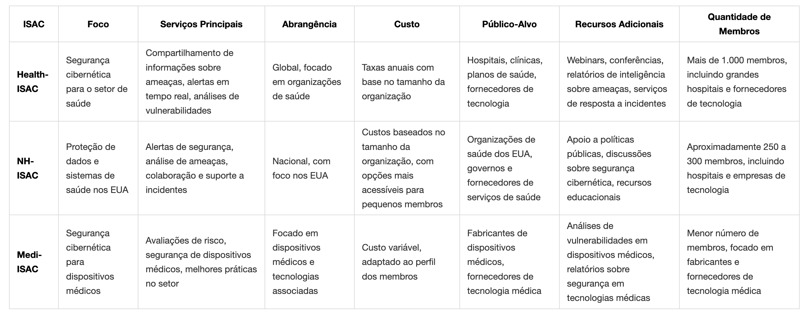
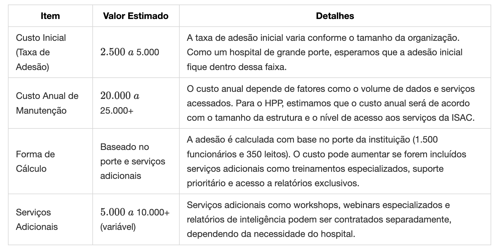
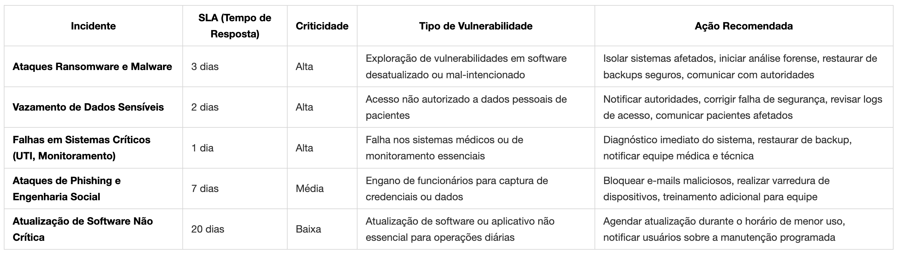

# Projeto Executivo: SOC para [Nome do Hospital Fictício]

### Estruturação Estratégica de um Security Operations Center (SOC)

### em Ambiente Hospitalar

    

**Apresentado por:**

- Amarildo Lucena - [ajfl@cesar.school](mailto:ajfl@cesar.school)
- Julio Vilar - [jvmm@cesar.school](mailto:jvmm@cesar.school)
- Rafael Winter - [rwt@cesar.school](mailto:rwt@cesar.school)

**Instituição:**  
[Nome da Instituição de Ensino]

  

**Data:**  
[Mês/Ano]

## Sumário

(fazer por último)

## Introdução

### Contextualização (temporário)

O setor de saúde tem se tornado um alvo cada vez mais atrativo para ataques cibernéticos devido ao alto valor dos dados de pacientes, à crescente digitalização dos serviços médicos e à dependência crítica de sistemas tecnológicos para procedimentos e atendimentos. Hospitais são particularmente vulneráveis devido à combinação de dados sensíveis, sistemas legados, dispositivos médicos conectados (IoMT) e o impacto potencialmente fatal de interrupções operacionais.

#### Custos e dados financeiros (Julio: DONE)

O setor de saúde continua sendo o mais afetado por violação de dados, com um custo médio de US$ 9,77 milhões por incidente, o maior entre as indústrias, segundo o relatório da IBM "Cost of a Data Breach 2024". Embora tenha havido uma redução de 10,6% em relação a 2023, o valor ainda é mais que o dobro da média global de US$ 4,88 milhões.

O uso de IA e automação reduziu os custos das violações em até US$ 2,22 milhões e acelerou a detecção e contenção dos incidentes. A OMS reportou um aumento de 500% nos incidentes de segurança cibernética em instalações de saúde durante a pandemia de COVID-19, período em que a digitalização acelerada dos serviços criou novas vulnerabilidades.

#### Consequencias de ataques e cases (Amarildo)

Ataques cibernéticos ao setor de saúde têm se tornado uma das principais ameaças à segurança das informações e à continuidade dos serviços médicos. Com o aumento do uso de tecnologia e sistemas digitais nos hospitais e clínicas, os cibercriminosos têm explorado vulnerabilidades, visando dados sensíveis dos pacientes, como históricos médicos, diagnósticos e informações pessoais. Os ransomware, phishing e ataques DDoS são as formas mais comuns desses ataques. As consequências podem ser devastadoras: desde a perda de dados médicos essenciais até a interrupção de serviços de saúde críticos, afetando diretamente a vida dos pacientes. Em alguns casos, como já documentado, ataques cibernéticos resultaram em mortes e danos irreparáveis à integridade física de pessoas. Além disso, as instituições de saúde enfrentam prejuízos financeiros significativos, tanto pelos custos associados ao resgate (no caso de ransomware), quanto pela paralisação de sistemas e a reconstrução de infraestruturas comprometidas.

No cenário global, os números de ataques cibernéticos no setor de saúde são alarmantes. Em 2024, 43% das empresas de saúde ao redor do mundo foram vítimas de ciberataques, com destaque para os ataques de ransomware, que continuam a ser uma das maiores ameaças à segurança cibernética no setor (Kaspersky, 2024). No Brasil, o cenário é igualmente preocupante: 47% das instituições de saúde registraram ataques cibernéticos em 2024, evidenciando a crescente vulnerabilidade desse setor no país (Kaspersky, 2024). Em 2023, o aumento dos ataques foi significativo, com um crescimento de 20% em relação ao ano anterior, destacando o risco crescente de ciberameaças à medida que a digitalização do setor de saúde avança (Check Point Research, 2023). Esses dados ressaltam a urgência da implementação de medidas de segurança cibernética no setor, a fim de proteger tanto as informações dos pacientes quanto a continuidade dos serviços médicos.

Em termos de casos emblemáticos, o ataque ao Hospital Universitário de Düsseldorf na Alemanha, em 2020, se destaca como um dos mais graves e significativos no setor de saúde. O ataque de ransomware resultou na morte de uma paciente, que não conseguiu receber o tratamento adequado devido à interrupção dos sistemas hospitalares (BBC News, 2020). Esse incidente trouxe à tona as consequências fatais que um ataque cibernético pode causar quando sistemas críticos de saúde são comprometidos. Outro caso de grande repercussão foi o ataque ao National Health Service (NHS) no Reino Unido em 2017, que afetou mais de 200.000 pessoas, causando o cancelamento de cirurgias e consultas e expondo a vulnerabilidade dos sistemas de saúde pública à ação de cibercriminosos (Reuters, 2017).

No Brasil, a Rede D'Or São Luiz, uma das maiores redes hospitalares privadas do país, foi alvo de um ataque cibernético em 2021. O incidente resultou na perda de dados sensíveis de pacientes e na interrupção de serviços médicos essenciais, afetando a operação da rede hospitalar (Exame, 2021). Outros exemplos de ataques no Brasil incluem o caso do Hospital das Clínicas da USP, que sofreu um ataque de ransomware em 2020, comprometendo dados dos pacientes e paralisando serviços médicos essenciais, e o ataque à Prefeitura de Vitória, que afetou serviços de saúde pública no município (G1, 2020; Gazeta Online, 2020). Esses incidentes destacam o impacto crescente dos ataques cibernéticos em hospitais tanto públicos quanto privados no Brasil, com consequências graves para a continuidade dos tratamentos e segurança dos dados dos pacientes.

Historicamente, antes de 2023, os dados sobre ataques cibernéticos ao setor de saúde eram limitados, e os registros sobre as consequências diretas desses ataques, como mortes ou perda de dados médicos, eram escassos ou pouco divulgados. No entanto, a partir de 2023, houve um aumento significativo na documentação de ataques e suas repercussões, com uma ênfase maior em como as interrupções podem afetar diretamente a saúde dos pacientes. Em comparação aos dados de 2023, os números de 2024 indicam um crescimento no número de ataques ao setor, com o aumento de ransomware sendo um dos fatores mais preocupantes. O aumento de 20% nos incidentes em 2024, em relação a 2023, reflete uma escalada da ameaça à medida que os cibercriminosos continuam a aprimorar suas táticas e direcionar suas ações para um setor vulnerável e crucial para a sociedade (Kaspersky, 2024; Check Point Research, 2023).

**// TODO (amarildo): revisar e expandir os dois parágrafos acima - e falar sobre o incidente da Rede D'Or**

#### Influência da pandemia, evolução tecnológica e cenário regulatório (Winter)

A expansão da telemedicina, acelerada durante a pandemia, introduziu novos vetores de ataque, com dispositivos remotos nem sempre adequadamente protegidos. Paralelamente, o aumento de equipamentos médicos conectados (IoMT) - de bombas de infusão a marcapassos - ampliou significativamente a superfície de ataque. Estima-se que um hospital médio possua entre 10 e 15 dispositivos conectados por leito, muitos dos quais com vulnerabilidades conhecidas e sem possibilidade de atualização.

O cenário regulatório também evoluiu com a implementação da Lei Geral de Proteção de Dados (LGPD) no Brasil, estabelecendo obrigações específicas para o tratamento de dados sensíveis de saúde e impondo sanções severas para violações, que podem chegar a 2% do faturamento anual, limitado a R$ 50 milhões por infração.

Este contexto de ameaças sofisticadas, superfícies de ataque expandidas e requisitos regulatórios rigorosos torna imperativa a implementação de um Centro de Operações de Segurança (SOC) dedicado e especializado para ambientes hospitalares.

### Perfil do Hospital

**// TODO (amarildo): ver o hospital de House**

O Hospital Princeton-Plainsboro (HPP) é uma instituição de grande porte localizada em uma capital brasileira, e faz parte da liga Ivy League, com capacidade para 350 leitos, sendo 50 de UTI. O hospital possui diversas especialidades médicas, com destaque para cardiologia, oncologia e neurocirurgia. A instituição conta com cerca de 1.500 funcionários e atende aproximadamente 15.000 pacientes mensalmente.

Em termos tecnológicos, o HPPT possui:

- Sistema de Prontuário Eletrônico de Paciente (PEP)
- Sistema de Gestão Hospitalar (ERP)
- Equipamentos médicos conectados à rede
- Plataforma de telemedicina
- Diversos sistemas departamentais (laboratório, farmácia, radiologia)
- Infraestrutura híbrida com serviços em nuvem e on-premises

### Objetivos do Projeto

Este projeto executivo visa estabelecer um Security Operations Center (SOC) personalizado para o Hospital Central Tecnológico, com foco em:

1. Proteger dados sensíveis de pacientes e informações clínicas (Winter: intro)
2. Garantir a disponibilidade ininterrupta de sistemas críticos para o atendimento (Winter: como seria a forma ininterrupta?!)
3. Detectar e responder rapidamente a ameaças cibernéticas específicas do setor hospitalar (Julio: criar tabela - tipo de vulnerabilidade, criticidade, SLA, )
4. Assegurar conformidade com a LGPD e outras regulamentações aplicáveis (Winter: desenvolver mais)
5. Desenvolver capacidades internas para monitoramento, detecção e resposta a incidentes (Amarildo: estratégia de monitoramento e ferramentas)
6. Estabelecer protocolos de cooperação para compartilhamento de informações sobre ameaças (Julio: In progress)

O SOC proposto será dimensionado para as necessidades específicas do HCT, considerando seus recursos tecnológicos, humanos e financeiros, bem como os riscos específicos ao seu ambiente operacional.

### Riscos Cibernéticos na Saúde: Como se Diferenciam do OWASP Top 10

O OWASP Top 10 concentra-se principalmente em vulnerabilidades de aplicações web, enquanto o setor de saúde enfrenta desafios mais amplos, incluindo ransomware, IoT attacks e social engineering.

Apesar dessas diferenças, há pontos em comum, como code injection, authentication failures e vulnerable APIs, que também representam riscos significativos para sistemas médicos.

#### Ransomware

O maior risco para hospitais e clínicas. Os invasores criptografam dados críticos e exigem resgate para liberar o acesso.

Exemplo real: WannaCry afetou hospitais no mundo todo, paralisando serviços essenciais.

#### Phishing

E-mails fraudulentos são usados para enganar funcionários, médicos e administradores, levando-os a revelar credenciais ou instalar malware, o que pode resultar no comprometimento de redes hospitalares.

Exemplo real: Entre dezembro de 2020 e abril de 2021, a UC San Diego Health foi alvo de uma campanha de phishing que resultou no acesso não autorizado a contas de e-mail de funcionários. Os invasores puderam visualizar dados pessoais e médicos de pacientes, incluindo nomes, diagnósticos e informações de tratamento. A instituição notificou os indivíduos afetados e implementou medidas adicionais de segurança para prevenir futuros incidentes. ​

#### Outdated Software and Systems

Muitos hospitais usam sistemas legados sem atualizações, facilitando invasões.

Exemplo: O ataque via [CVE-2017-0199](https://msrc.microsoft.com/update-guide/vulnerability/CVE-2017-0199) falha no Microsoft Office.

#### Man-in-the-Middle

Hackers interceptam dados médicos sigilosos entre dispositivos médicos e servidores.

Exemplo de ataque: Em 2016, pesquisadores demonstraram que dispositivos médicos conectados, como marcapassos e bombas de insulina, podiam ser alvo de ataques cibernéticos. Esses dispositivos, ao perderem autenticação com a unidade médica, podem ser interceptados, permitindo que atacantes ouçam, modifiquem ou bloqueiem comunicações.

#### IoT Device Attacks

Equipamentos como marcapassos, bombas de insulina e monitores cardíacos podem ser hackeados.

Exemplo de ataque: Estudos já mostraram que marcapassos conectados podem ser desativados remotamente.

#### Data Breach

Prontuários eletrônicos contêm dados sensíveis, e embora a LGPD e a HIPAA busquem proteger essas informações, vazamentos ainda ocorrem.

#### Engenharia Social

Funcionários são manipulados para fornecer acesso a hackers.

Exemplo de ataque: Alguém se passando por técnico de TI pedindo credenciais para "manutenção".

#### DDoS

Ataques sobrecarregam sistemas hospitalares, impedindo o acesso a registros médicos e prejudicando emergências, forçando os hospitais a pagar resgates para encerrar o ataque.

Exemplo real: em 2023, o Idaho Falls Community Hospital, localizado nos Estados Unidos, sofreu um ataque cibernético que levou ao desvio de ambulâncias para outras instituições. Os profissionais de saúde tiveram que registrar informações dos pacientes manualmente devido à falha nos sistemas informatizados.

#### Healthcare API Attacks

Falhas de autenticação em aplicativos médicos e sistemas de telemedicina podem permitir acesso não autorizado, enquanto APIs mal configuradas possibilitam o acesso a registros médicos e receitas digitais.

#### Malware on USB Devices and Internal Connections

Funcionários conectam pendrives infectados, instalando vírus nos sistemas hospitalares, enquanto hackers podem comprometer impressoras, câmeras e computadores administrativos para escalar privilégios.

## Compartilhamento de informações e análise de tendências
Fazer parte de uma ISAC é crucial para fortalecer nossa segurança cibernética, permitindo o compartilhamento de informações sobre ameaças em tempo real e garantindo uma resposta mais ágil e eficaz a incidentes. A colaboração entre organizações nos ajuda a minimizar riscos e danos, além de proporcionar acesso a melhores práticas, ferramentas de análise e treinamento especializado. Em um ambiente digital cada vez mais complexo, a união de forças é essencial para proteger dados sensíveis e preservar a confiança dos pacientes.

### Análise Comparativa de ISAC's com foco na área de saúde

<!-- table markdown version
| **ISAC**           | **Foco**                           | **Serviços Principais**                                | **Abrangência**                         | **Custo**                  | **Público-Alvo**                          | **Recursos Adicionais**                               | **Quantidade de Membros**               |
|--------------------|------------------------------------|--------------------------------------------------------|-----------------------------------------|----------------------------|-------------------------------------------|------------------------------------------------------|----------------------------------------|
| **Health-ISAC**     | Segurança cibernética para o setor de saúde | Compartilhamento de informações sobre ameaças, alertas em tempo real, análises de vulnerabilidades | Global, focado em organizações de saúde | Taxas anuais com base no tamanho da organização | Hospitais, clínicas, planos de saúde, fornecedores de tecnologia | Webinars, conferências, relatórios de inteligência sobre ameaças, serviços de resposta a incidentes | Mais de 1.000 membros, incluindo grandes hospitais e fornecedores de tecnologia |
| **NH-ISAC**         | Proteção de dados e sistemas de saúde nos EUA | Alertas de segurança, análise de ameaças, colaboração e suporte a incidentes | Nacional, com foco nos EUA | Custos baseados no tamanho da organização, com opções mais acessíveis para pequenos membros | Organizações de saúde dos EUA, governos e fornecedores de serviços de saúde | Apoio a políticas públicas, discussões sobre segurança cibernética, recursos educacionais | Aproximadamente 250 a 300 membros, incluindo hospitais e empresas de tecnologia |
| **Medi-ISAC**       | Segurança cibernética para dispositivos médicos | Avaliações de risco, segurança de dispositivos médicos, melhores práticas no setor | Focado em dispositivos médicos e tecnologias associadas | Custo variável, adaptado ao perfil dos membros | Fabricantes de dispositivos médicos, fornecedores de tecnologia médica | Análises de vulnerabilidades em dispositivos médicos, relatórios sobre segurança em tecnologias médicas | Menor número de membros, focado em fabricantes e fornecedores de tecnologia médica |

 -->

### Sugestão de ISAC: Proposta de Melhoria após Análise Comparativa

 O Health-ISAC é a melhor opção devido à sua rede global que conecta diversas organizações de saúde, permitindo acesso a informações e alertas sobre ameaças em tempo real. Ele oferece recursos valiosos, como análises de vulnerabilidades, relatórios de inteligência e treinamentos especializados. Essa abordagem colaborativa garante proteção eficaz de dados sensíveis e mantém a confiança dos pacientes.

#### Detalhamento de custos
<!-- markdown version

| **Item**                 | **Valor Estimado**                        | **Detalhes**                                                         |
|--------------------------|------------------------------------------|---------------------------------------------------------------------|
| Custo Inicial (Taxa de Adesão) | $2.500  a  $5.000                     | A taxa de adesão inicial varia conforme o tamanho da organização. Como um hospital de grande porte, esperamos que a adesão inicial fique dentro dessa faixa. |
| Custo Anual de Manutenção | $20.000  a  $25.000+                   | O custo anual depende de fatores como o volume de dados e serviços acessados. Para o HPP, estimamos que o custo anual será de acordo com o tamanho da estrutura e o nível de acesso aos serviços da ISAC. |
| Forma de Cálculo     | Baseado no porte e serviços adicionais | A adesão é calculada com base no porte da instituição (1.500 funcionários e 350 leitos). O custo pode aumentar se forem incluídos serviços adicionais como treinamentos especializados, suporte prioritário e acesso a relatórios exclusivos. |
| Serviços Adicionais  | $5.000  a  $10.000+ (variável)          | Serviços adicionais como workshops, webinars especializados e relatórios de inteligência podem ser contratados separadamente, dependendo da necessidade do hospital. |

 -->

## Plano de Resposta a Incidentes Cibernéticos Hospitalares

Este plano é essencial para assegurar a resposta rápida e eficaz a incidentes cibernéticos, minimizando impactos nas operações do hospital. Ele ajuda a proteger dados sensíveis e a garantir que os sistemas críticos continuem funcionando sem interrupções. Além disso, contribui para a proteção da reputação da instituição e a redução de riscos financeiros, fornecendo uma estrutura clara para a equipe de TI lidar com qualquer incidente de forma coordenada e eficiente.

### Definição de criticidade
**Alta:** Incidentes que afetam a segurança dos dados sensíveis dos pacientes ou a operação crítica do hospital, como ransomware ou falhas no monitoramento de UTI.

**Média:** Incidentes que causam interrupções ou riscos, mas que podem ser mitigados sem danos significativos à segurança dos pacientes ou à infraestrutura.

**Baixa:** Incidentes que não impactam diretamente a saúde dos pacientes ou a operação do hospital, mas que ainda precisam ser gerenciados adequadamente, como ataques de DoS.

<!-- markdown version

| **Incidente**                                        | **SLA (Tempo de Resposta)** | **Criticidade** | **Tipo de Vulnerabilidade**                                                  | **Ação Recomendada**                                                                                       |
| ---------------------------------------------------- | --------------------------- | --------------- | ---------------------------------------------------------------------------- | ---------------------------------------------------------------------------------------------------------- |
| **Ataques Ransomware e Malware**                     | 3 dias                      | Alta            | Exploração de vulnerabilidades em software desatualizado ou mal-intencionado | Isolar sistemas afetados, iniciar análise forense, restaurar de backups seguros, comunicar com autoridades |
| **Vazamento de Dados Sensíveis**                     | 2 dias                      | Alta            | Acesso não autorizado a dados pessoais de pacientes                          | Notificar autoridades, corrigir falha de segurança, revisar logs de acesso, comunicar pacientes afetados   |
| **Falhas em Sistemas Críticos (UTI, Monitoramento)** | 1 dia                       | Alta            | Falha nos sistemas médicos ou de monitoramento essenciais                    | Diagnóstico imediato do sistema, restaurar de backup, notificar equipe médica e técnica                    |
| **Ataques de Phishing e Engenharia Social**          | 7 dias                      | Média           | Engano de funcionários para captura de credenciais ou dados                  | Bloquear e-mails maliciosos, realizar varredura de dispositivos, treinamento adicional para equipe         |
| **Atualização de Software Não Crítica**              | 20 dias                     | Baixa           | Atualização de software ou aplicativo não essencial para operações diárias   | Agendar atualização durante o horário de menor uso, notificar usuários sobre a manutenção programada       |

 -->

## Referências

### 1. Cost of a Data Breach Report 2024

- Data: 2024
- Autor: IBM Corporation
- Link: https://www.ibm.com/reports/data-breach

### 2. The Cybersecurity Consolidation Conundrum: Why Less is Sometimes More

- Data: June 17, 2022
- Autor: Check Point Research Team
- Link: https://blog.checkpoint.com/security/the-cybersecurity-consolidation-conundrum-why-less-is-sometimes-more/

### 3. As 10 principais vulnerabilidades e exposições comuns exploradas rotineiramente

- Data: 2020
- Autor: Health ISAC
- Link: https://health-isac.org/pt/10-principais-vulnerabilidades-comuns-exploradas-rotineiramente/

### 4. Vulnerabilidades

- Data: Não informada
- Autor: Kaspersky
- Link: https://www.kaspersky.com.br/resource-center/threats/ransomware-wannacry

- Data: 2019
- Autor: Troy Brown
- Link: https://portugues.medscape.com/verartigo/6504044?form=fpf

- Data: 2025
- Autor: Michael Manchas (NCC Group)
- Link: https://www.nccgroup.com/us/the-top-5-cyber-security-concerns-for-the-healthcare-industry-in-2025-part-1/

**// TODO (winter): colocar todas referências**
